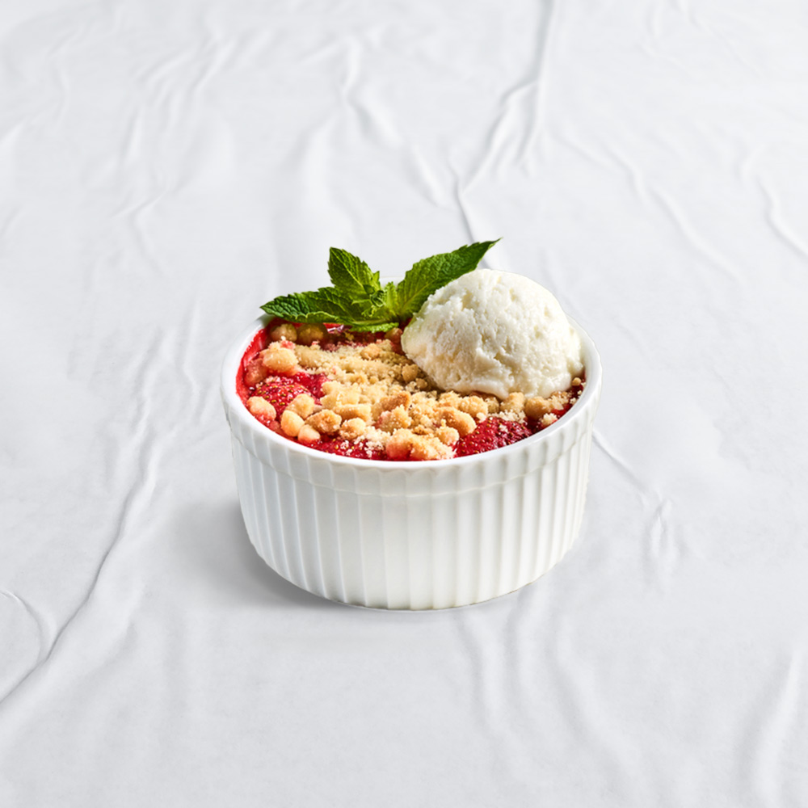

### PRZEPISY
(zrób to sam!)

1. *Oryginalne włoskie ciasto na pizzę*

   Składniki:
   
- 500 g mąki typu "00" (można użyć również mąki chlebowej)
- 325 ml ciepłej wody (około 37°C)
- 10 g soli
- 7 g suchych drożdży (lub 25 g świeżych drożdży)
- 1 łyżeczka cukru
- 2 łyżki oliwy z oliwek

  ## Instrukcje:
- Rozczyn z drożdży:

Jeśli używasz świeżych drożdży, rozpuść je w ciepłej wodzie z dodatkiem cukru. Pozostaw na 10 minut, aż drożdże zaczną pracować (pojawią się bąbelki).
Jeśli używasz suchych drożdży, wymieszaj je z mąką.

- Mieszanie składników:

W dużej misce wymieszaj mąkę i sól.
Dodaj rozczyn z drożdży (jeśli używasz świeżych) lub wodę (jeśli używasz suchych drożdży) i oliwę z oliwek.

- Wyrabianie ciasta:

Wyrabiaj ciasto ręcznie lub przy użyciu miksera z hakiem do ciasta przez około 10 minut, aż stanie się gładkie i elastyczne.

- Pierwsze wyrastanie:

Przełóż ciasto do lekko naoliwionej miski, przykryj ściereczką lub folią spożywczą i pozostaw w ciepłym miejscu na około 1-2 godziny, aż podwoi swoją objętość.

- Formowanie pizzy:

Po wyrośnięciu, delikatnie wyciągnij ciasto z miski i podziel na 2-4 części, w zależności od tego, jak duże pizze chcesz zrobić.
Uformuj kulki z każdej części i pozostaw je na około 15-20 minut, aby odpoczęły.

- Rozwałkowanie ciasta:

Na lekko oprószonej mąką powierzchni rozwałkuj ciasto na pożądaną grubość, tworząc klasyczny okrągły kształt pizzy.

- Przygotowanie pizzy:

Nałóż ulubione składniki na ciasto i piecz w nagrzanym do 250°C piekarniku (lub na maksymalnej temperaturze twojego piekarnika) przez około 10-12 minut, aż ciasto będzie złociste, a ser roztopiony i lekko przypieczony.

*Buon Appetito!*

2. *Truskawki pod kruszonką*

   Składniki:
Na nadzienie:

- 500 g truskawek, umytych i pokrojonych na połówki lub ćwiartki
- 2-3 łyżki cukru (ilość do smaku)
- 1 łyżeczka soku z cytryny
- 1 łyżka mąki ziemniaczanej (opcjonalnie, jeśli truskawki są bardzo soczyste)

Na kruszonkę:

- 150 g mąki
- 100 g masła, zimnego i pokrojonego w kostkę
- 80 g cukru (biały lub brązowy)
- 1 łyżeczka cukru waniliowego (opcjonalnie)
szczypta soli

## Instrukcje:

- Przygotowanie truskawek:

W misce wymieszaj truskawki z cukrem, sokiem z cytryny i mąką ziemniaczaną (jeśli używasz). Odstaw na bok.

- Przygotowanie kruszonki:

W dużej misce wymieszaj mąkę, cukier, cukier waniliowy i sól.
Dodaj zimne masło i szybko zagnieć palcami lub przy pomocy miksera, aż powstaną grudki przypominające kruszonkę.

- Składanie deseru:

Przełóż truskawki do naczynia żaroodpornego, równomiernie rozprowadzając po dnie.
Posyp truskawki kruszonką, równomiernie ją rozkładając.

- Pieczenie:

Nagrzej piekarnik do 180°C.
Piecz truskawki pod kruszonką przez około 30-35 minut, aż kruszonka będzie złocista, a truskawki miękkie i soczyste.

- Podawanie:

Wyjmij deser z piekarnika i odstaw na kilka minut, aby lekko ostygł.
Podawaj na ciepło, najlepiej z lodami waniliowymi lub bitą śmietaną.

Smacznego!

